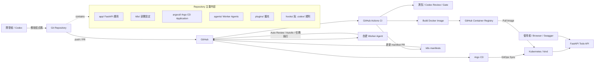
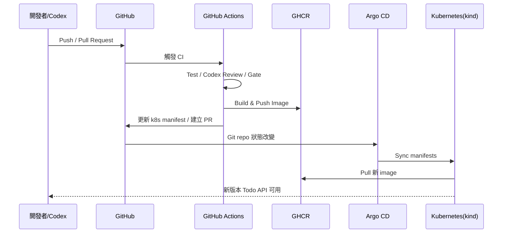

# 系統架構圖

本專案是一個以 FastAPI 為核心的 Todo API，並串接 GitHub Actions、GHCR、Argo CD、Kubernetes(kind) 與自建 Worker Agent，形成從開發、CI/CD 到 GitOps 部署的完整實戰流程。

## 整體架構

## CI/CD 與 GitOps 流程

## 元件職責

| 元件 | 職責 |
|---|---|
| `app/` | FastAPI Todo API 與前端/Swagger 入口 |
| GitHub Actions | CI、測試、Codex review/gate、建置與發佈 image |
| GHCR | 儲存 Todo API Docker image |
| `k8s/` | Kubernetes Deployment / Service 等 manifests |
| `argocd/` | Argo CD Application，持續同步 Git 狀態 |
| kind | 本機 Kubernetes 實驗環境 |
| `agents/` | 自建 Worker Agent、auto-review、autofix 等 |
| `.codex/` / `hooks/` | Codex 規則、hooks 與自動化護欄 |
| `plugins/` | 額外擴充能力 |

## 一句話理解

> Codex 協助開發 → GitHub Actions 驗證與建置 → GHCR 保存映像 → Argo CD 監看 Git → Kubernetes 自動同步部署；Worker Agent 再回頭協助 GitHub 上的 review 與修復流程。
